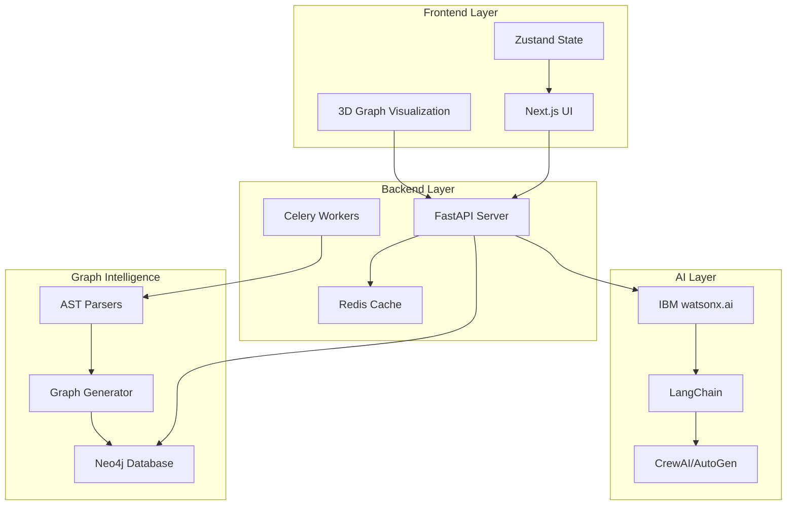

# GraphMind AI - Complete MVP Implementation Plan

## Executive Summary

**Project**: GraphMind AI — AI-Native Engineering Cognition Platform  
**Vision**: Transform repositories into interactive 3D semantic graph intelligence systems  
**Core Innovation**: Spatial repository understanding through AI-guided graph traversal  
**Target**: "Neo4j + AI Engineering Intelligence + Workflow Cognition + Repository Digital Twin"

---

## System Architecture Overview



---

## Technology Stack

### Frontend
- **Framework**: Next.js 14 (App Router)
- **Styling**: TailwindCSS + shadcn/ui
- **3D Visualization**: React Three Fiber + Drei + ForceGraph3D
- **Animation**: Framer Motion
- **State Management**: Zustand
- **HTTP Client**: Axios
- **WebSocket**: Socket.io-client

### Backend
- **API Framework**: FastAPI
- **Task Queue**: Celery + Redis
- **Cache**: Redis
- **Authentication**: JWT
- **File Processing**: GitPython, zipfile
- **API Documentation**: OpenAPI/Swagger

### Graph Database
- **Database**: Neo4j 5.x
- **Driver**: neo4j-python-driver
- **Query Language**: Cypher

### AI & Intelligence
- **Primary LLM**: IBM watsonx.ai
- **Orchestration**: LangChain
- **Multi-Agent**: CrewAI or AutoGen
- **Embeddings**: IBM watsonx.ai embeddings
- **Vector Store**: Neo4j Vector Index

### Code Parsing
- **Multi-Language**: Tree-sitter
- **TypeScript**: ts-morph
- **JavaScript**: Babel Parser
- **Python**: ast module
- **Generic**: pygments, ctags

### DevOps
- **Containerization**: Docker + Docker Compose
- **Orchestration**: Kubernetes (optional)
- **CI/CD**: GitHub Actions
- **Monitoring**: Prometheus + Grafana

---

## Project Structure

```
graphmind-ai/
├── frontend/                    # Next.js frontend
│   ├── app/                    # App router pages
│   ├── components/             # React components
│   │   ├── graph/             # 3D graph components
│   │   ├── ui/                # UI components
│   │   └── layout/            # Layout components
│   ├── lib/                   # Utilities
│   ├── store/                 # Zustand stores
│   ├── hooks/                 # Custom hooks
│   └── public/                # Static assets
│
├── backend/                    # FastAPI backend
│   ├── app/
│   │   ├── api/               # API routes
│   │   │   ├── v1/
│   │   │   │   ├── repository.py
│   │   │   │   ├── graph.py
│   │   │   │   ├── ai.py
│   │   │   │   └── workflow.py
│   │   ├── core/              # Core functionality
│   │   │   ├── config.py
│   │   │   ├── security.py
│   │   │   └── dependencies.py
│   │   ├── services/          # Business logic
│   │   │   ├── repository_service.py
│   │   │   ├── graph_service.py
│   │   │   ├── ai_service.py
│   │   │   └── parser_service.py
│   │   ├── models/            # Pydantic models
│   │   ├── db/                # Database
│   │   │   ├── neo4j.py
│   │   │   └── redis.py
│   │   └── workers/           # Celery tasks
│   │       ├── parser_tasks.py
│   │       └── graph_tasks.py
│   └── tests/
│
├── parsers/                    # Code parsing engines
│   ├── typescript_parser.py
│   ├── javascript_parser.py
│   ├── python_parser.py
│   └── base_parser.py
│
├── ai/                        # AI intelligence layer
│   ├── watsonx_client.py
│   ├── langchain_chains.py
│   ├── agents/
│   │   ├── explanation_agent.py
│   │   ├── workflow_agent.py
│   │   └── debug_agent.py
│   └── prompts/
│
├── graph/                     # Graph intelligence
│   ├── schema.py              # Neo4j schema
│   ├── generator.py           # Graph generation
│   ├── queries.py             # Cypher queries
│   └── traversal.py           # Graph traversal
│
├── docker/                    # Docker configs
│   ├── Dockerfile.frontend
│   ├── Dockerfile.backend
│   └── docker-compose.yml
│
├── docs/                      # Documentation
│   ├── architecture.md
│   ├── api.md
│   └── deployment.md
│
└── scripts/                   # Utility scripts
    ├── setup.sh
    └── seed_data.py
```

---

## Phase 1: Foundation & Repository Intelligence

### 1.1 Project Initialization

**Deliverables**:
- Repository structure
- Development environment setup
- Docker configuration
- CI/CD pipeline

**Tasks**:
1. Initialize monorepo structure
2. Setup Next.js frontend with TypeScript
3. Setup FastAPI backend with Python 3.11+
4. Configure Docker Compose for local development
5. Setup Neo4j container
6. Setup Redis container
7. Configure environment variables
8. Initialize Git repository with proper `.gitignore`

**Files to Create**:
- [`docker-compose.yml`](docker-compose.yml)
- [`frontend/package.json`](frontend/package.json)
- [`backend/requirements.txt`](backend/requirements.txt)
- [`.env.example`](.env.example)
- [`README.md`](README.md)

---

### 1.2 Backend Infrastructure Setup

**Deliverables**:
- FastAPI application structure
- Neo4j connection
- Redis connection
- Authentication system
- API documentation

**Tasks**:
1. Create FastAPI application with proper structure
2. Implement Neo4j driver and connection pool
3. Implement Redis client
4. Setup JWT authentication
5. Create base API routes
6. Configure CORS
7. Setup OpenAPI documentation
8. Implement error handling middleware

**Key Files**:
- [`backend/app/main.py`](backend/app/main.py)
- [`backend/app/core/config.py`](backend/app/core/config.py)
- [`backend/app/db/neo4j.py`](backend/app/db/neo4j.py)
- [`backend/app/db/redis.py`](backend/app/db/redis.py)
- [`backend/app/core/security.py`](backend/app/core/security.py)

---

### 1.3 Repository Intelligence Engine

**Deliverables**:
- Multi-language AST parser
- Repository ingestion system
- File structure analyzer
- Relationship extractor

**Supported Languages**:
- TypeScript/JavaScript (Tree-sitter + ts-morph + Babel)
- Python (ast module + Tree-sitter)
- Extensible for other languages

**Extraction Targets**:
- Functions and methods
- Classes and interfaces
- Imports and exports
- API endpoints
- Database queries
- Service calls
- Event handlers
- Middleware
- Configuration files

**Tasks**:
1. Implement base parser interface
2. Create TypeScript/JavaScript parser using ts-morph
3. Create Python parser using ast module
4. Implement Tree-sitter integration for multi-language support
5. Build relationship extraction logic
6. Create dependency analyzer
7. Implement execution flow detector
8. Build API endpoint detector

**Key Files**:
- [`parsers/base_parser.py`](parsers/base_parser.py)
- [`parsers/typescript_parser.py`](parsers/typescript_parser.py)
- [`parsers/python_parser.py`](parsers/python_parser.py)
- [`backend/app/services/parser_service.py`](backend/app/services/parser_service.py)

**Parser Output Schema**:
```python
{
    "nodes": [
        {
            "id": "unique_id",
            "type": "function|class|api|service|file",
            "name": "node_name",
            "file_path": "relative/path",
            "line_start": 10,
            "line_end": 50,
            "metadata": {
                "complexity": 5,
                "parameters": [],
                "return_type": "string",
                "docstring": "..."
            }
        }
    ],
    "edges": [
        {
            "source": "node_id_1",
            "target": "node_id_2",
            "type": "CALLS|IMPORTS|DEPENDS_ON",
            "metadata": {
                "line_number": 25,
                "execution_order": 1
            }
        }
    ]
}
```

---

### 1.4 Semantic Graph Engine

**Deliverables**:
- Neo4j schema definition
- Graph generation pipeline
- Cypher query library
- Graph traversal algorithms

**Neo4j Schema**:

```cypher
// Node Types
CREATE CONSTRAINT service_id IF NOT EXISTS FOR (s:Service) REQUIRE s.id IS UNIQUE;
CREATE CONSTRAINT api_id IF NOT EXISTS FOR (a:API) REQUIRE a.id IS UNIQUE;
CREATE CONSTRAINT function_id IF NOT EXISTS FOR (f:Function) REQUIRE f.id IS UNIQUE;
CREATE CONSTRAINT file_id IF NOT EXISTS FOR (f:File) REQUIRE f.id IS UNIQUE;
CREATE CONSTRAINT database_id IF NOT EXISTS FOR (d:Database) REQUIRE d.id IS UNIQUE;

// Node Properties
(:Service {
    id: string,
    name: string,
    type: string,
    file_path: string,
    description: string,
    risk_score: float,
    importance: int
})

(:API {
    id: string,
    endpoint: string,
    method: string,
    file_path: string,
    line_number: int,
    auth_required: boolean
})

(:Function {
    id: string,
    name: string,
    file_path: string,
    line_start: int,
    line_end: int,
    complexity: int,
    parameters: list,
    return_type: string
})

// Edge Types with Metadata
(:Service)-[:CALLS {
    execution_order: int,
    latency_ms: float,
    failure_rate: float,
    frequency: int
}]->(:Service)

(:API)-[:USES {
    required: boolean,
    fallback_available: boolean
}]->(:Service)

(:Function)-[:DEPENDS_ON {
    dependency_type: string,
    critical: boolean
}]->(:Function)

(:Service)-[:WRITES_TO {
    operation: string,
    frequency: int
}]->(:Database)

(:Service)-[:READS_FROM {
    query_type: string,
    cache_enabled: boolean
}]->(:Database)
```

**Tasks**:
1. Define complete Neo4j schema
2. Create graph generation pipeline
3. Implement node creation logic
4. Implement edge creation logic
5. Build graph indexing
6. Create Cypher query templates
7. Implement graph traversal algorithms
8. Build graph update mechanisms

**Key Files**:
- [`graph/schema.py`](graph/schema.py)
- [`graph/generator.py`](graph/generator.py)
- [`graph/queries.py`](graph/queries.py)
- [`graph/traversal.py`](graph/traversal.py)

---

## Phase 2: Visualization & AI Integration

### 2.1 Frontend Foundation

**Deliverables**:
- Next.js application structure
- TailwindCSS configuration
- Component library
- State management
- API client

**Tasks**:
1. Initialize Next.js with App Router
2. Configure TailwindCSS + shadcn/ui
3. Setup Zustand stores
4. Create API client with Axios
5. Implement authentication flow
6. Build layout components
7. Create UI component library
8. Setup routing structure

**Key Files**:
- [`frontend/app/layout.tsx`](frontend/app/layout.tsx)
- [`frontend/app/page.tsx`](frontend/app/page.tsx)
- [`frontend/lib/api-client.ts`](frontend/lib/api-client.ts)
- [`frontend/store/graph-store.ts`](frontend/store/graph-store.ts)
- [`frontend/tailwind.config.ts`](frontend/tailwind.config.ts)

---

### 2.2 3D Visualization Engine

**Deliverables**:
- Interactive 3D graph renderer
- Node and edge components
- Graph physics simulation
- Camera controls
- Graph interactions

**Visualization Features**:
- Force-directed graph layout
- Draggable nodes
- Zoom/pan/rotate controls
- Node clustering
- Path highlighting
- Semantic overlays
- Smooth animations
- Performance optimization for large graphs

**Tasks**:
1. Setup React Three Fiber
2. Integrate ForceGraph3D
3. Create custom node components
4. Create custom edge components
5. Implement graph physics
6. Build camera controls
7. Add interaction handlers (click, hover, drag)
8. Implement graph filtering
9. Add path highlighting
10. Optimize rendering performance

**Key Files**:
- [`frontend/components/graph/GraphCanvas.tsx`](frontend/components/graph/GraphCanvas.tsx)
- [`frontend/components/graph/Node3D.tsx`](frontend/components/graph/Node3D.tsx)
- [`frontend/components/graph/Edge3D.tsx`](frontend/components/graph/Edge3D.tsx)
- [`frontend/components/graph/GraphControls.tsx`](frontend/components/graph/GraphControls.tsx)
- [`frontend/hooks/useGraphInteraction.ts`](frontend/hooks/useGraphInteraction.ts)

**Node Design Specification**:
```typescript
interface Node3DProps {
    id: string;
    type: NodeType;
    label: string;
    position: Vector3;
    metadata: {
        description: string;
        riskScore: number;
        importance: number;
        dependencyCount: number;
        status: 'active' | 'inactive' | 'error';
    };
    color: string;
    size: number;
    onClick: (node: Node) => void;
    onHover: (node: Node | null) => void;
}
```

---

### 2.3 AI Cognition Layer

**Deliverables**:
- IBM watsonx.ai integration
- LangChain orchestration
- AI explanation system
- Query processing
- Context management

**AI Capabilities**:
- Repository architecture explanation
- Node and edge explanations
- Workflow summarization
- Execution path analysis
- Bottleneck identification
- Risk assessment
- Natural language queries
- Contextual recommendations

**Tasks**:
1. Setup IBM watsonx.ai client
2. Configure LangChain
3. Create prompt templates
4. Build explanation agents
5. Implement query processing
6. Create context retrieval system
7. Build response formatting
8. Implement streaming responses

**Key Files**:
- [`ai/watsonx_client.py`](ai/watsonx_client.py)
- [`ai/langchain_chains.py`](ai/langchain_chains.py)
- [`ai/agents/explanation_agent.py`](ai/agents/explanation_agent.py)
- [`ai/prompts/system_prompts.py`](ai/prompts/system_prompts.py)
- [`backend/app/services/ai_service.py`](backend/app/services/ai_service.py)

**AI Prompt Templates**:
```python
ARCHITECTURE_EXPLANATION = """
You are an expert software architect analyzing a repository graph.

Repository Context:
{repository_context}

Graph Structure:
{graph_structure}

User Query: {user_query}

Provide a clear, technical explanation focusing on:
1. Architecture patterns
2. Service relationships
3. Data flow
4. Key dependencies
5. Potential issues

Response:
"""

NODE_EXPLANATION = """
Explain this code entity in the context of the repository:

Node Type: {node_type}
Node Name: {node_name}
File: {file_path}
Code:
{code_snippet}

Connected Nodes:
{connections}

Provide:
1. Purpose and functionality
2. Role in the system
3. Dependencies and relationships
4. Potential issues or improvements
"""
```

---

### 2.4 API Endpoints

**Deliverables**:
- Repository management APIs
- Graph query APIs
- AI query APIs
- Workflow APIs

**API Routes**:

```python
# Repository APIs
POST   /api/v1/repository/upload          # Upload repository
POST   /api/v1/repository/clone           # Clone from Git
GET    /api/v1/repository/{id}            # Get repository info
DELETE /api/v1/repository/{id}            # Delete repository
GET    /api/v1/repository/{id}/status     # Get processing status

# Graph APIs
GET    /api/v1/graph/{repo_id}            # Get full graph
GET    /api/v1/graph/{repo_id}/node/{id}  # Get node details
GET    /api/v1/graph/{repo_id}/traverse   # Traverse graph
POST   /api/v1/graph/{repo_id}/query      # Query graph
GET    /api/v1/graph/{repo_id}/path       # Find path between nodes

# AI APIs
POST   /api/v1/ai/explain                 # Explain node/workflow
POST   /api/v1/ai/query                   # Natural language query
POST   /api/v1/ai/analyze                 # Analyze architecture
GET    /api/v1/ai/suggestions             # Get suggestions

# Workflow APIs
GET    /api/v1/workflow/{repo_id}         # Get workflows
POST   /api/v1/workflow/{repo_id}/trace   # Trace execution
GET    /api/v1/workflow/{repo_id}/debug   # Debug workflow
```

**Key Files**:
- [`backend/app/api/v1/repository.py`](backend/app/api/v1/repository.py)
- [`backend/app/api/v1/graph.py`](backend/app/api/v1/graph.py)
- [`backend/app/api/v1/ai.py`](backend/app/api/v1/ai.py)
- [`backend/app/api/v1/workflow.py`](backend/app/api/v1/workflow.py)

---

## Phase 3: Advanced Intelligence

### 3.1 Workflow Orchestration Layer

**Deliverables**:
- Workflow graph visualization
- Agent orchestration mapping
- Execution flow tracking
- Status monitoring

**Workflow Types**:
- CI/CD pipelines
- Testing workflows
- Deployment orchestration
- Documentation generation
- Incident response
- Debugging workflows

**Tasks**:
1. Define workflow schema
2. Create workflow parser
3. Build workflow graph generator
4. Implement execution tracking
5. Create workflow visualization
6. Build agent orchestration system
7. Implement status monitoring

**Key Files**:
- [`backend/app/services/workflow_service.py`](backend/app/services/workflow_service.py)
- [`ai/agents/workflow_agent.py`](ai/agents/workflow_agent.py)
- [`frontend/components/workflow/WorkflowGraph.tsx`](frontend/components/workflow/WorkflowGraph.tsx)

---

### 3.2 Debugging Intelligence Layer

**Deliverables**:
- Failure propagation visualization
- Root cause analysis
- Impact assessment
- Fix suggestions

**Features**:
- Trace failure propagation through graph
- Identify root causes
- Visualize affected services
- Suggest fixes
- Highlight risky nodes
- Show dependency chains

**Tasks**:
1. Implement failure propagation algorithm
2. Build root cause analyzer
3. Create impact assessment system
4. Implement fix suggestion engine
5. Build debugging visualization
6. Create debugging agent

**Key Files**:
- [`backend/app/services/debug_service.py`](backend/app/services/debug_service.py)
- [`ai/agents/debug_agent.py`](ai/agents/debug_agent.py)
- [`graph/propagation.py`](graph/propagation.py)
- [`frontend/components/debug/DebugView.tsx`](frontend/components/debug/DebugView.tsx)

**Propagation Algorithm**:
```python
def trace_failure_propagation(
    graph: Neo4jGraph,
    failed_node_id: str,
    max_depth: int = 5
) -> PropagationTree:
    """
    Trace how a failure in one node propagates through the system.
    
    Returns a tree showing:
    - Directly affected nodes
    - Indirectly affected nodes
    - Propagation paths
    - Impact severity
    """
    pass
```

---

### 3.3 Documentation Intelligence Layer

**Deliverables**:
- Auto-generated documentation
- Architecture diagrams
- API documentation
- Onboarding guides

**Generated Documentation**:
- README summaries
- Architecture explanations
- Service documentation
- API reference
- Workflow documentation
- Dependency explanations
- Setup guides

**Tasks**:
1. Create documentation templates
2. Build documentation generator
3. Implement architecture diagram generation
4. Create API doc generator
5. Build onboarding guide generator
6. Implement documentation agent

**Key Files**:
- [`backend/app/services/documentation_service.py`](backend/app/services/documentation_service.py)
- [`ai/agents/documentation_agent.py`](ai/agents/documentation_agent.py)

---

## Phase 4: Enterprise Features

### 4.1 Developer Onboarding Engine

**Deliverables**:
- Onboarding roadmap generator
- Learning path creation
- Guided graph traversal
- Interactive tutorials

**Features**:
- Analyze repository complexity
- Generate learning paths
- Create "start here" guides
- Interactive walkthroughs
- Progress tracking

**Tasks**:
1. Build complexity analyzer
2. Create learning path generator
3. Implement guided traversal
4. Build interactive tutorial system
5. Create progress tracking

**Key Files**:
- [`backend/app/services/onboarding_service.py`](backend/app/services/onboarding_service.py)
- [`frontend/components/onboarding/OnboardingWizard.tsx`](frontend/components/onboarding/OnboardingWizard.tsx)

---

### 4.2 Infrastructure Visualization

**Deliverables**:
- Infrastructure graph
- Deployment architecture
- Container visualization
- Cloud resource mapping

**Visualize**:
- Docker containers
- Kubernetes pods
- APIs and gateways
- Databases
- Message queues
- Event streams
- Cloud services

**Tasks**:
1. Parse infrastructure configs (docker-compose, k8s)
2. Build infrastructure graph
3. Create infrastructure visualization
4. Implement resource monitoring integration

**Key Files**:
- [`backend/app/services/infrastructure_service.py`](backend/app/services/infrastructure_service.py)
- [`parsers/infrastructure_parser.py`](parsers/infrastructure_parser.py)
- [`frontend/components/infrastructure/InfraView.tsx`](frontend/components/infrastructure/InfraView.tsx)

---

### 4.3 Multi-Agent Orchestration

**Deliverables**:
- Agent coordination system
- Task distribution
- Agent communication
- Workflow automation

**Agents**:
- Explanation Agent
- Workflow Agent
- Debug Agent
- Documentation Agent
- Onboarding Agent
- Risk Assessment Agent

**Tasks**:
1. Setup CrewAI or AutoGen
2. Define agent roles
3. Implement agent communication
4. Build task orchestration
5. Create agent coordination system

**Key Files**:
- [`ai/orchestration/crew_setup.py`](ai/orchestration/crew_setup.py)
- [`ai/agents/coordinator.py`](ai/agents/coordinator.py)

---

### 4.4 Risk Intelligence System

**Deliverables**:
- Risk scoring algorithm
- Vulnerability detection
- Performance bottleneck identification
- Predictive analysis

**Risk Factors**:
- Code complexity
- Dependency depth
- Failure history
- Performance metrics
- Security vulnerabilities
- Technical debt

**Tasks**:
1. Define risk scoring model
2. Implement risk calculator
3. Build vulnerability scanner
4. Create bottleneck detector
5. Implement predictive models

**Key Files**:
- [`backend/app/services/risk_service.py`](backend/app/services/risk_service.py)
- [`ai/models/risk_model.py`](ai/models/risk_model.py)

---

## Implementation Timeline

### Week 1-2: Foundation
- Project setup
- Backend infrastructure
- Database setup
- Basic API structure

### Week 3-4: Repository Intelligence
- Parser implementation
- AST extraction
- Relationship detection
- Graph generation

### Week 5-6: Visualization
- Frontend setup
- 3D graph rendering
- Basic interactions
- UI components

### Week 7-8: AI Integration
- watsonx.ai setup
- LangChain integration
- Basic explanations
- Query system

### Week 9-10: Advanced Features
- Workflow orchestration
- Debugging intelligence
- Documentation generation

### Week 11-12: Enterprise Features
- Onboarding system
- Infrastructure visualization
- Multi-agent orchestration
- Risk intelligence

### Week 13-14: Testing & Polish
- Integration testing
- Performance optimization
- UI/UX refinement
- Documentation

### Week 15-16: Deployment
- Production setup
- Monitoring
- Security hardening
- Launch preparation

---

## Key Technical Decisions

### 1. Graph Database Choice: Neo4j
**Rationale**: Native graph database with excellent Cypher query language, vector search capabilities, and proven scalability.

### 2. Frontend Framework: Next.js
**Rationale**: Server-side rendering, excellent developer experience, built-in optimization, and strong ecosystem.

### 3. 3D Library: React Three Fiber
**Rationale**: Declarative 3D in React, excellent performance, large community, and extensive documentation.

### 4. AI Provider: IBM watsonx.ai
**Rationale**: Enterprise-grade, IBM integration, strong NLP capabilities, and compliance features.

### 5. Backend Framework: FastAPI
**Rationale**: High performance, automatic API documentation, async support, and Python ecosystem.

---

## Performance Considerations

### Graph Rendering
- Implement level-of-detail (LOD) for large graphs
- Use instancing for repeated geometries
- Implement frustum culling
- Lazy load graph sections
- Use Web Workers for heavy computations

### API Performance
- Implement caching with Redis
- Use connection pooling for Neo4j
- Implement pagination for large results
- Use async/await throughout
- Implement rate limiting

### AI Performance
- Cache common queries
- Implement streaming responses
- Use batch processing where possible
- Implement request queuing
- Monitor token usage

---

## Security Considerations

### Authentication & Authorization
- JWT-based authentication
- Role-based access control (RBAC)
- API key management
- Session management

### Data Security
- Encrypt sensitive data at rest
- Use HTTPS for all communications
- Implement input validation
- Sanitize user inputs
- Implement CORS properly

### Repository Security
- Scan for secrets before processing
- Implement access controls
- Audit logging
- Secure file storage

---

## Monitoring & Observability

### Metrics to Track
- API response times
- Graph query performance
- AI response times
- Error rates
- User interactions
- Resource utilization

### Tools
- Prometheus for metrics
- Grafana for visualization
- Sentry for error tracking
- Custom logging system

---

## Testing Strategy

### Unit Tests
- Parser logic
- Graph generation
- API endpoints
- AI prompts

### Integration Tests
- End-to-end workflows
- API integration
- Database operations
- AI integration

### Performance Tests
- Load testing
- Stress testing
- Graph rendering performance
- API throughput

### User Testing
- Usability testing
- A/B testing
- Beta user feedback

---

## Deployment Strategy

### Development Environment
- Docker Compose for local development
- Hot reloading for frontend and backend
- Local Neo4j instance
- Mock AI responses for testing

### Staging Environment
- Kubernetes cluster
- Production-like configuration
- Real AI integration
- Performance monitoring

### Production Environment
- Kubernetes with auto-scaling
- Load balancing
- CDN for static assets
- Backup and disaster recovery
- Monitoring and alerting

---

## Success Metrics

### Technical Metrics
- Graph generation time < 5 minutes for medium repos
- 3D rendering at 60 FPS for graphs with < 1000 nodes
- API response time < 200ms (p95)
- AI explanation time < 3 seconds

### User Metrics
- Time to understand repository architecture < 30 minutes
- Onboarding time reduction by 50%
- Debugging time reduction by 40%
- Documentation generation time < 5 minutes

---

## Risk Mitigation

### Technical Risks
- **Large repository performance**: Implement progressive loading and graph simplification
- **AI accuracy**: Implement feedback loops and continuous improvement
- **3D rendering performance**: Implement LOD and optimization techniques
- **Neo4j scalability**: Implement sharding and clustering

### Business Risks
- **User adoption**: Focus on clear value proposition and excellent UX
- **Competition**: Emphasize unique graph-based approach
- **Cost**: Optimize AI usage and implement caching

---

## Future Enhancements

### Phase 5 (Post-MVP)
- Real-time collaboration
- Version control integration
- Custom plugin system
- Mobile application
- Advanced analytics
- Machine learning for predictions
- Integration marketplace
- Enterprise SSO
- Advanced security features
- Multi-repository analysis

---

## Conclusion

GraphMind AI represents a paradigm shift in how developers understand and interact with codebases. By combining semantic graph intelligence, AI cognition, and immersive 3D visualization, we create an engineering cognition platform that reduces cognitive load, accelerates onboarding, and transforms repository understanding from a linear reading experience into a spatial exploration journey.

The platform's success hinges on three core pillars:
1. **Accurate graph intelligence** through sophisticated parsing
2. **Intuitive 3D visualization** that feels natural and responsive
3. **Contextual AI explanations** that provide genuine insights

With this comprehensive implementation plan, we have a clear roadmap to build an MVP that demonstrates the transformative potential of AI-native engineering cognition.

---

**Next Steps**: Review this plan, approve the architecture, and switch to Code mode to begin implementation.