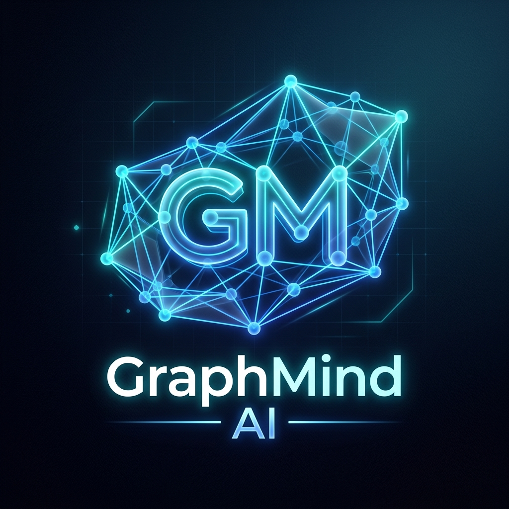

<div align="center">
  
  <h1>GraphMind AI</h1>
  <p><strong>AI-Native Engineering Cognition Platform</strong></p>
  <p>Transform repositories into interactive 3D semantic intelligence graphs.</p>
</div>

---

## 🌟 The Vision: Enterprise-Level Production Idea

GraphMind AI was conceived to be a fully enterprise-grade **AI-native engineering cognition platform**. The initial vision was to fundamentally transform how developers understand, navigate, and interact with large-scale software systems.

Instead of viewing repositories as static text files, GraphMind AI aims to create a **living, interactive 3D semantic graph digital twin** of the entire codebase.

- **Deep AST Parsing**: Multi-language true AST parsing mapping out services, APIs, databases, and every function call.
- **Neo4j Graph Backend**: Scalable knowledge graph engine powering instantaneous traversal across millions of nodes.
- **Watsonx LLM Integration**: True contextual AI that reads the actual repository structure and generates insights on failure propagation, technical debt, and architecture recommendations.
- **Advanced Workflow Orchestration**: Real-time CI/CD execution mapping mapped directly onto the 3D semantic graph.

---

## 🛠️ The Reality: What Has Been Implemented (Prototype)

Within the constraints of a rapid hackathon environment, we successfully built a powerful **Proof of Concept (PoC) prototype** that demonstrates the core user experience and frontend visualizations. 

**Currently Implemented:**
- ✅ **3D Semantic Graph Visualization**: A fully interactive, force-directed 3D graph built with React Three Fiber, allowing dragging, zooming, and spatial exploration of a mocked codebase.
- ✅ **Frontend Application**: A sleek, glassmorphic Next.js UI showcasing the enterprise-grade aesthetic.
- ✅ **Firebase Authentication**: User authentication securely handled via Google Firebase Auth.
- ✅ **FastAPI Backend (Mocked)**: A Python FastAPI backend with secured endpoints (JWT dependency injected) serving mock graph data and mocked AI responses.
- ✅ **Basic AI Integration**: A simulated Watsonx response service demonstrating how contextual explanations will appear in the UI.

---

## ⚠️ Prototype Limitations (The 48-Hour Constraint)

While the prototype looks and feels like the final product, several technical realities prevented the delivery of the full enterprise architecture within the 48-hour timeframe:

1. **No Real-Time AST Parsing**: Extracting deep semantic structures across multiple languages (TypeScript, Python, etc.) requires robust AST parsers (like Tree-sitter). Integrating these to generate dynamic Neo4j Cypher queries dynamically was too complex for a two-day window.
2. **Mocked Neo4j Database**: Setting up, securing, and properly seeding a Neo4j database container with complex, real-world repository relationships was replaced with a static JSON response to ensure the 3D visualization could be demonstrated flawlessly.
3. **Mocked Watsonx Responses**: Tuning the IBM watsonx.ai prompts with LangChain to consume and accurately interpret massive graph contexts requires extensive prompt engineering and token limit management, which we bypassed with static but highly realistic simulated responses.
4. **Local Execution Only**: Full CI/CD pipelines, container orchestration (Kubernetes), and production deployments were descoped to focus on local developer experience and UI/UX validation.

> [!WARNING]
> **I've used antigravity in the laterstage because the 40 BOBcoins got exhausted.**

---

<div style="display: flex; justify-content: center; gap: 20px; flex-wrap: wrap;">
  <div align="center">
    
  </div>
  
  <div align="center">
    
  </div>
  
  <div align="center">
    
  </div>
</div>

---

## 🚀 Developer Quick Start Guide

To continue development on GraphMind AI, follow these minute details to get the project running locally.

### Prerequisites
- Node.js (v18+)
- Python (v3.11+)
- Firebase Project configured for Authentication (Email/Password)

### 1. Backend Setup (FastAPI)

1. Navigate to the backend directory:
   ```bash
   cd backend
   ```
2. Create and activate a virtual environment:
   ```bash
   python -m venv venv
   # Windows:
   venv\Scripts\activate
   # Mac/Linux:
   source venv/bin/activate
   ```
3. Install dependencies:
   ```bash
   pip install -r requirements.txt
   ```
4. Create a `.env` file in the `backend/` directory based on `.env.example`.
5. Run the server:
   ```bash
   uvicorn app.main:app --reload --host 0.0.0.0 --port 8000
   ```
   *The backend will be available at `http://localhost:8000`. API Docs are at `http://localhost:8000/docs`.*

### 2. Frontend Setup (Next.js)

1. Open a new terminal and navigate to the frontend directory:
   ```bash
   cd frontend
   ```
2. Install dependencies:
   ```bash
   npm install
   ```
3. Set up Firebase:
   - Create a `.env.local` file in the `frontend/` directory.
   - Add your Firebase configuration:
     ```env
     NEXT_PUBLIC_FIREBASE_API_KEY=your_api_key
     NEXT_PUBLIC_FIREBASE_AUTH_DOMAIN=your_project_id.firebaseapp.com
     NEXT_PUBLIC_FIREBASE_PROJECT_ID=your_project_id
     NEXT_PUBLIC_FIREBASE_STORAGE_BUCKET=your_project_id.appspot.com
     NEXT_PUBLIC_FIREBASE_MESSAGING_SENDER_ID=your_sender_id
     NEXT_PUBLIC_FIREBASE_APP_ID=your_app_id
     ```
4. Run the development server:
   ```bash
   npm run dev
   ```
   *The frontend will be available at `http://localhost:3000`.*

---

## 🔒 Security Posture

- **Authentication**: Client-side authentication is handled natively by Firebase SDK.
- **API Protection**: Backend API routes (`/api/graph`, `/api/ai/*`) are protected by a `get_current_user` dependency that verifies the Firebase ID Token using the Firebase Admin SDK.
- **CORS Configuration**: The backend dynamically accepts CORS from configured origins.

---

## 📄 License

This project is licensed under the MIT License. Built for the IBM BOB Challenge.
