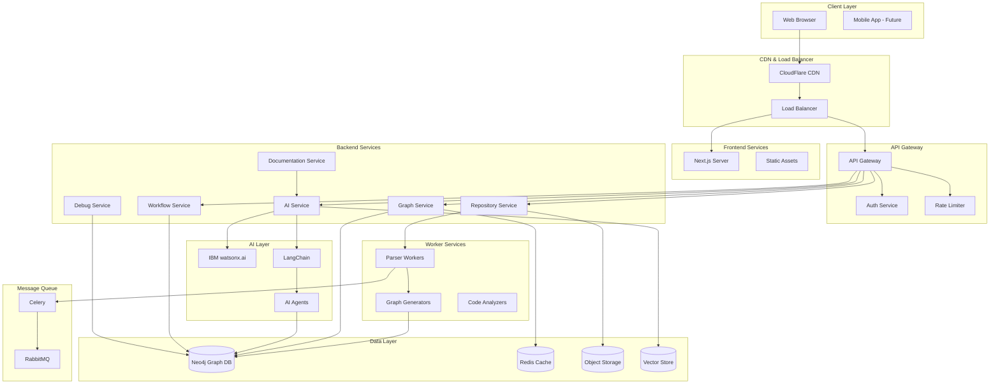
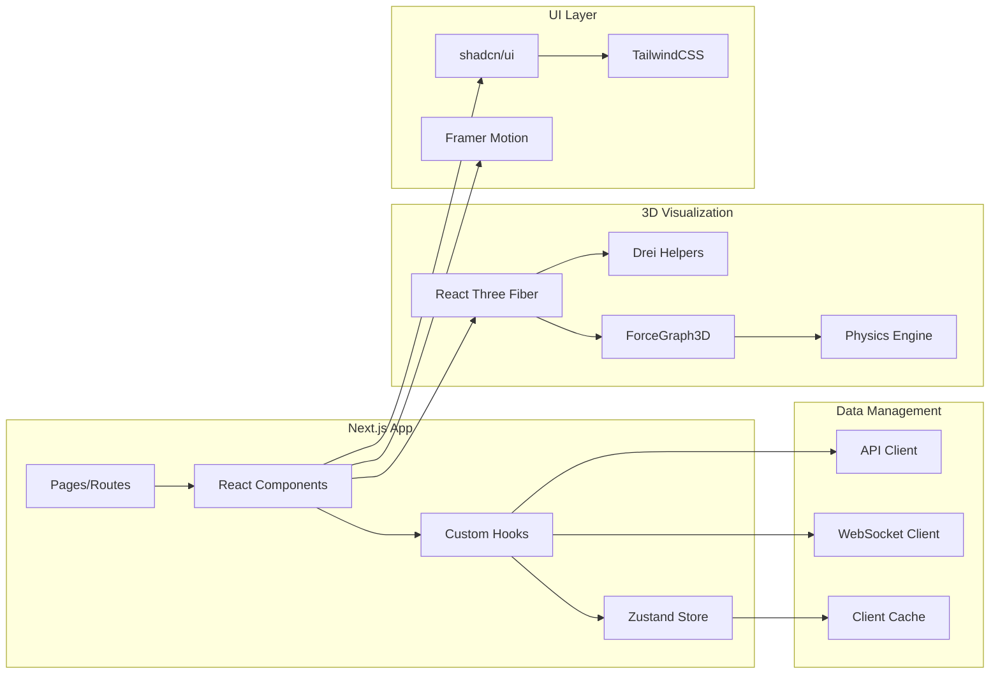
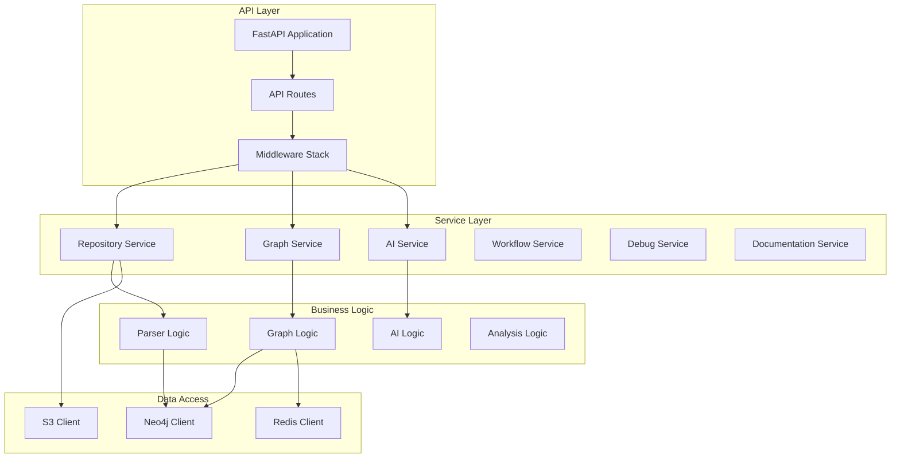
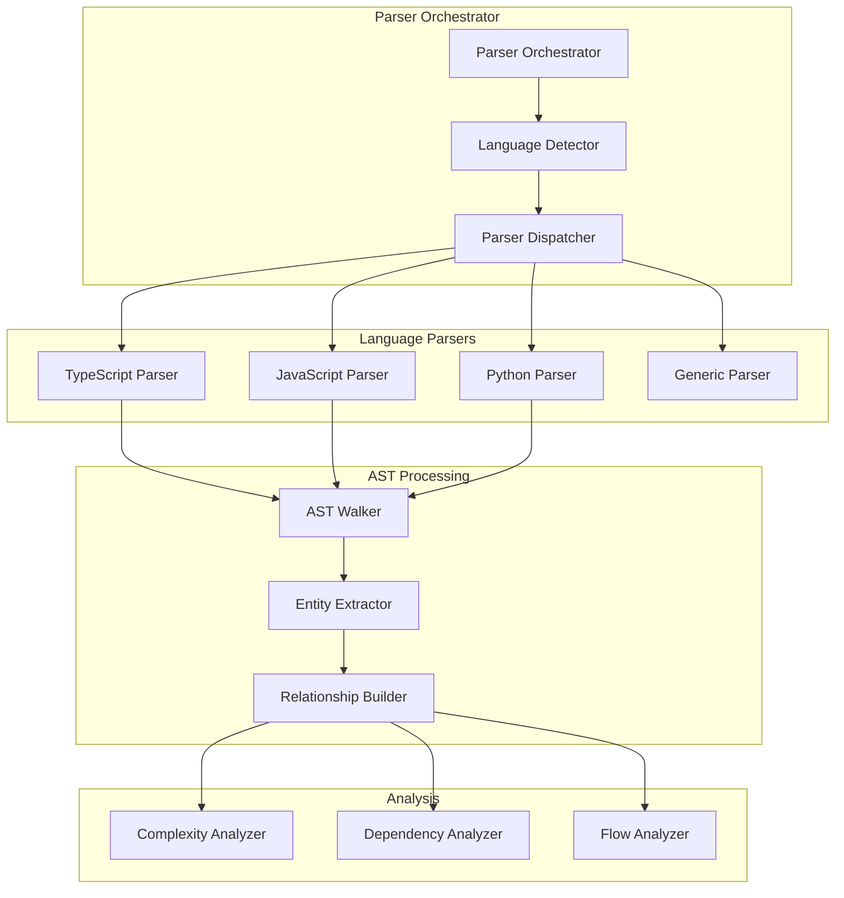
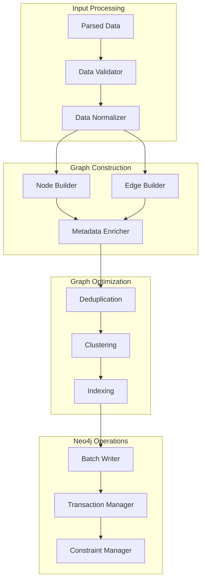
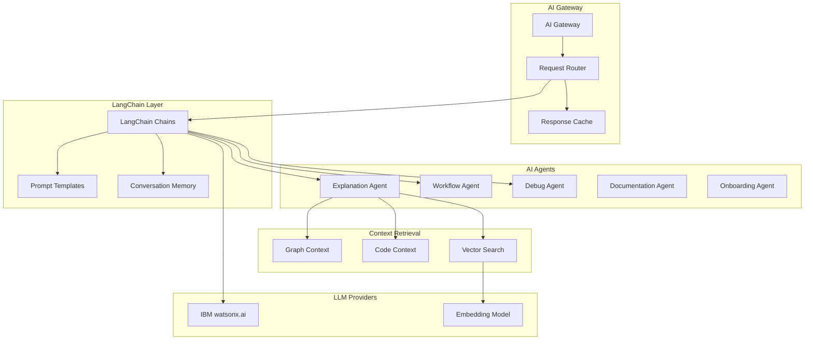
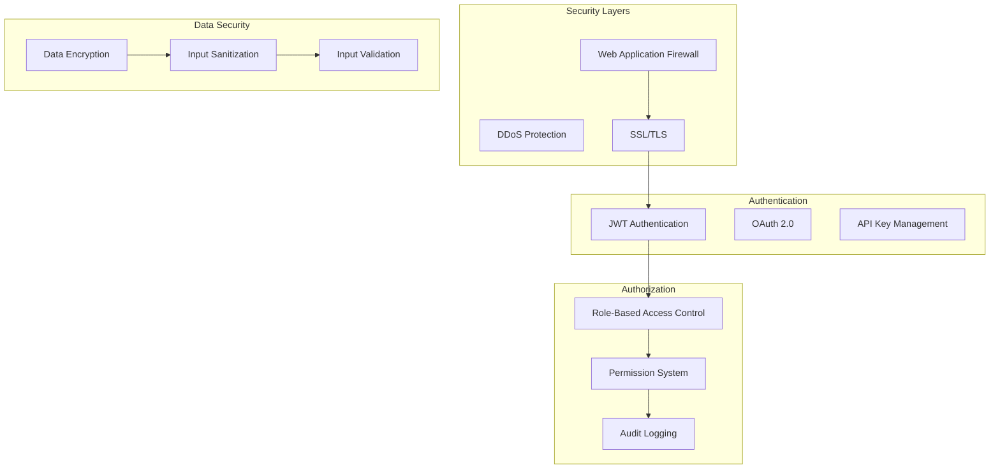
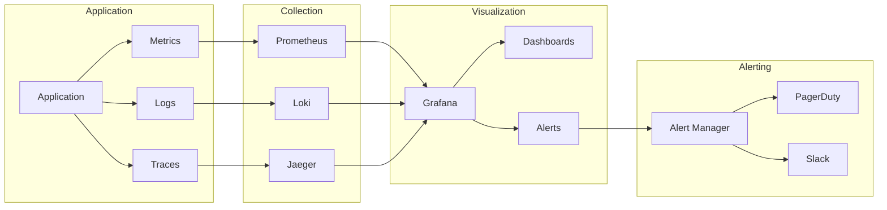
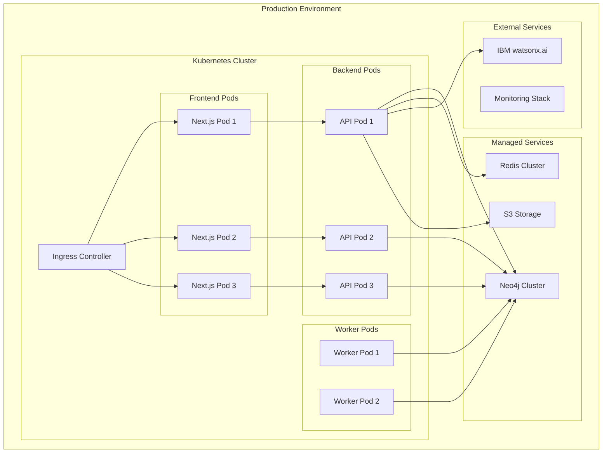

# GraphMind AI - Technical Architecture

## System Overview

GraphMind AI is a distributed, microservices-based platform that transforms code repositories into interactive 3D semantic graphs with AI-powered intelligence.

---

## High-Level Architecture



---

## Component Architecture

### 1. Frontend Architecture



**Key Frontend Components**:

1. **Graph Canvas** (`GraphCanvas.tsx`)
   - Main 3D rendering container
   - Camera controls
   - Scene management
   - Performance optimization

2. **Node Components** (`Node3D.tsx`)
   - Visual representation of code entities
   - Interactive behaviors
   - Metadata display
   - Status indicators

3. **Edge Components** (`Edge3D.tsx`)
   - Relationship visualization
   - Flow direction indicators
   - Metadata overlays
   - Animation effects

4. **Control Panel** (`ControlPanel.tsx`)
   - Graph filtering
   - Search functionality
   - View controls
   - Settings

5. **AI Chat Interface** (`AIChat.tsx`)
   - Natural language queries
   - Streaming responses
   - Context display
   - Graph highlighting

---

### 2. Backend Architecture



**Service Responsibilities**:

1. **Repository Service**
   - Handle repository uploads
   - Clone Git repositories
   - Manage repository metadata
   - Trigger parsing jobs

2. **Graph Service**
   - Query graph data
   - Traverse relationships
   - Filter and search
   - Update graph metadata

3. **AI Service**
   - Process natural language queries
   - Generate explanations
   - Provide recommendations
   - Coordinate AI agents

4. **Workflow Service**
   - Manage workflow definitions
   - Track execution flows
   - Visualize orchestration
   - Monitor status

5. **Debug Service**
   - Trace failure propagation
   - Identify root causes
   - Suggest fixes
   - Analyze impact

6. **Documentation Service**
   - Generate documentation
   - Create architecture diagrams
   - Build onboarding guides
   - Export documentation

---

### 3. Parser Architecture



**Parser Pipeline**:

1. **File Discovery**
   - Scan repository structure
   - Identify source files
   - Detect languages
   - Filter ignored files

2. **AST Generation**
   - Parse source code
   - Generate abstract syntax trees
   - Handle syntax errors
   - Extract metadata

3. **Entity Extraction**
   - Identify functions
   - Identify classes
   - Identify imports/exports
   - Identify API endpoints

4. **Relationship Detection**
   - Function calls
   - Class inheritance
   - Module dependencies
   - Data flow

5. **Analysis**
   - Complexity metrics
   - Dependency depth
   - Execution paths
   - Risk assessment

---

### 4. Graph Generation Architecture



**Graph Generation Steps**:

1. **Node Creation**
   ```cypher
   CREATE (n:Function {
       id: $id,
       name: $name,
       file_path: $file_path,
       line_start: $line_start,
       line_end: $line_end,
       complexity: $complexity,
       parameters: $parameters,
       return_type: $return_type
   })
   ```

2. **Edge Creation**
   ```cypher
   MATCH (source:Function {id: $source_id})
   MATCH (target:Function {id: $target_id})
   CREATE (source)-[r:CALLS {
       line_number: $line_number,
       execution_order: $execution_order,
       frequency: $frequency
   }]->(target)
   ```

3. **Indexing**
   ```cypher
   CREATE INDEX function_name IF NOT EXISTS FOR (f:Function) ON (f.name);
   CREATE INDEX file_path IF NOT EXISTS FOR (f:File) ON (f.path);
   CREATE FULLTEXT INDEX entity_search IF NOT EXISTS FOR (n:Function|Class|Service) ON EACH [n.name, n.description];
   ```

---

### 5. AI Architecture



**AI Agent Responsibilities**:

1. **Explanation Agent**
   - Explain code entities
   - Describe relationships
   - Summarize workflows
   - Answer technical questions

2. **Workflow Agent**
   - Analyze execution flows
   - Identify bottlenecks
   - Suggest optimizations
   - Trace dependencies

3. **Debug Agent**
   - Analyze failures
   - Trace propagation
   - Identify root causes
   - Suggest fixes

4. **Documentation Agent**
   - Generate documentation
   - Create diagrams
   - Write guides
   - Explain architecture

5. **Onboarding Agent**
   - Create learning paths
   - Guide exploration
   - Recommend starting points
   - Track progress

---

### 6. Data Models

#### Neo4j Schema

**Node Types**:

```cypher
// Service Node
(:Service {
    id: string,
    name: string,
    type: string,
    file_path: string,
    description: string,
    risk_score: float,
    importance: int,
    created_at: datetime,
    updated_at: datetime
})

// API Node
(:API {
    id: string,
    endpoint: string,
    method: string,
    file_path: string,
    line_number: int,
    auth_required: boolean,
    rate_limit: int,
    description: string
})

// Function Node
(:Function {
    id: string,
    name: string,
    file_path: string,
    line_start: int,
    line_end: int,
    complexity: int,
    parameters: list,
    return_type: string,
    async: boolean,
    docstring: string
})

// Class Node
(:Class {
    id: string,
    name: string,
    file_path: string,
    line_start: int,
    line_end: int,
    methods: list,
    properties: list,
    extends: string,
    implements: list
})

// File Node
(:File {
    id: string,
    path: string,
    language: string,
    size: int,
    lines: int,
    last_modified: datetime
})

// Database Node
(:Database {
    id: string,
    name: string,
    type: string,
    host: string,
    port: int
})

// Queue Node
(:Queue {
    id: string,
    name: string,
    type: string,
    topics: list
})

// Workflow Node
(:Workflow {
    id: string,
    name: string,
    type: string,
    steps: list,
    status: string
})
```

**Edge Types**:

```cypher
// Function Call
(:Function)-[:CALLS {
    line_number: int,
    execution_order: int,
    frequency: int,
    latency_ms: float,
    failure_rate: float
}]->(:Function)

// Dependency
(:Service)-[:DEPENDS_ON {
    dependency_type: string,
    critical: boolean,
    version: string
}]->(:Service)

// Database Write
(:Service)-[:WRITES_TO {
    operation: string,
    table: string,
    frequency: int
}]->(:Database)

// Database Read
(:Service)-[:READS_FROM {
    query_type: string,
    table: string,
    cache_enabled: boolean
}]->(:Database)

// API Call
(:Service)-[:CALLS_API {
    method: string,
    endpoint: string,
    timeout_ms: int
}]->(:API)

// Event Trigger
(:Service)-[:TRIGGERS {
    event_type: string,
    async: boolean
}]->(:Queue)

// Event Listen
(:Service)-[:LISTENS_TO {
    event_type: string,
    handler: string
}]->(:Queue)

// Failure Propagation
(:Service)-[:FAILS_BECAUSE_OF {
    probability: float,
    impact_severity: string
}]->(:Service)
```

---

### 7. API Specifications

#### Repository APIs

```typescript
// Upload Repository
POST /api/v1/repository/upload
Content-Type: multipart/form-data

Request:
{
    file: File,
    name: string,
    description?: string
}

Response:
{
    id: string,
    name: string,
    status: "processing" | "completed" | "failed",
    created_at: string
}

// Clone Repository
POST /api/v1/repository/clone
Content-Type: application/json

Request:
{
    url: string,
    branch?: string,
    name?: string
}

Response:
{
    id: string,
    name: string,
    status: "cloning" | "processing" | "completed" | "failed",
    progress: number
}

// Get Repository Status
GET /api/v1/repository/{id}/status

Response:
{
    id: string,
    status: string,
    progress: number,
    current_step: string,
    nodes_created: number,
    edges_created: number,
    errors: string[]
}
```

#### Graph APIs

```typescript
// Get Graph Data
GET /api/v1/graph/{repo_id}?depth=2&node_types=Function,Service

Response:
{
    nodes: Node[],
    edges: Edge[],
    metadata: {
        total_nodes: number,
        total_edges: number,
        node_types: Record<string, number>
    }
}

// Get Node Details
GET /api/v1/graph/{repo_id}/node/{node_id}

Response:
{
    id: string,
    type: string,
    properties: Record<string, any>,
    incoming_edges: Edge[],
    outgoing_edges: Edge[],
    code_snippet: string,
    ai_summary: string
}

// Traverse Graph
POST /api/v1/graph/{repo_id}/traverse
Content-Type: application/json

Request:
{
    start_node_id: string,
    direction: "incoming" | "outgoing" | "both",
    edge_types?: string[],
    max_depth?: number
}

Response:
{
    path: Node[],
    edges: Edge[],
    depth: number
}

// Query Graph
POST /api/v1/graph/{repo_id}/query
Content-Type: application/json

Request:
{
    cypher: string,
    parameters?: Record<string, any>
}

Response:
{
    results: any[],
    execution_time_ms: number
}
```

#### AI APIs

```typescript
// Explain Node
POST /api/v1/ai/explain
Content-Type: application/json

Request:
{
    repo_id: string,
    node_id: string,
    context?: string
}

Response (Streaming):
{
    explanation: string,
    related_nodes: string[],
    suggestions: string[]
}

// Natural Language Query
POST /api/v1/ai/query
Content-Type: application/json

Request:
{
    repo_id: string,
    query: string,
    context?: string[]
}

Response (Streaming):
{
    answer: string,
    highlighted_nodes: string[],
    highlighted_paths: Path[],
    confidence: number
}

// Analyze Architecture
POST /api/v1/ai/analyze
Content-Type: application/json

Request:
{
    repo_id: string,
    analysis_type: "architecture" | "performance" | "security" | "complexity"
}

Response:
{
    summary: string,
    findings: Finding[],
    recommendations: Recommendation[],
    risk_score: number
}
```

---

### 8. Performance Optimization

#### Frontend Optimization

1. **Graph Rendering**
   - Implement level-of-detail (LOD)
   - Use instanced rendering
   - Implement frustum culling
   - Lazy load graph sections
   - Use Web Workers for physics

2. **Code Splitting**
   - Route-based splitting
   - Component lazy loading
   - Dynamic imports
   - Tree shaking

3. **Caching**
   - Service Worker caching
   - Browser cache
   - State persistence
   - API response caching

#### Backend Optimization

1. **Database Optimization**
   - Connection pooling
   - Query optimization
   - Proper indexing
   - Batch operations
   - Caching layer

2. **API Optimization**
   - Response compression
   - Pagination
   - Field selection
   - Rate limiting
   - Request batching

3. **Caching Strategy**
   - Redis for hot data
   - CDN for static assets
   - Query result caching
   - Computed value caching

---

### 9. Security Architecture



**Security Measures**:

1. **Authentication**
   - JWT-based authentication
   - OAuth 2.0 integration
   - API key management
   - Session management

2. **Authorization**
   - Role-based access control
   - Resource-level permissions
   - Audit logging
   - Access reviews

3. **Data Protection**
   - Encryption at rest
   - Encryption in transit
   - Input sanitization
   - Output encoding

4. **Repository Security**
   - Secret scanning
   - Dependency scanning
   - Code analysis
   - Access controls

---

### 10. Monitoring & Observability



**Monitoring Metrics**:

1. **Application Metrics**
   - Request rate
   - Response time
   - Error rate
   - Active users

2. **Infrastructure Metrics**
   - CPU usage
   - Memory usage
   - Disk I/O
   - Network traffic

3. **Database Metrics**
   - Query performance
   - Connection pool
   - Cache hit rate
   - Storage usage

4. **AI Metrics**
   - Token usage
   - Response time
   - Error rate
   - Cost tracking

---

## Deployment Architecture



---

## Conclusion

This technical architecture provides a comprehensive blueprint for building GraphMind AI as a scalable, performant, and maintainable platform. The architecture emphasizes:

1. **Modularity**: Clear separation of concerns
2. **Scalability**: Horizontal scaling capabilities
3. **Performance**: Optimized at every layer
4. **Security**: Defense in depth
5. **Observability**: Comprehensive monitoring
6. **Maintainability**: Clean code and documentation

The architecture is designed to support the platform's growth from MVP to enterprise-scale deployment while maintaining flexibility for future enhancements.